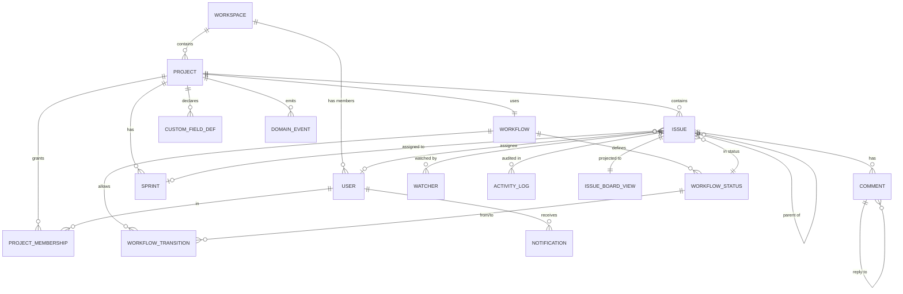

# Data Model & Schema

> **Implementation status.** All tables are migrated (Flyway `V1`–`V6`) with a demo seed
> (`R__seed_demo_data`), and Hibernate validates the entities against them at startup. Some tables
> back features that are **not yet implemented**: `comments`, `watchers`, `idempotency_keys`, and
> `custom_field_defs` (custom-field *values* are stored on issues but not yet validated). The
> `issue_board_view` read model is kept in sync by the board projector.

The relational design for the platform: entities, the ERD, full DDL for the core tables, the
indexing strategy, and the reasoning behind how we model issue hierarchies, custom fields, the
audit trail, search, and the CQRS read model.

> PostgreSQL is the system of record ([ADR-0003](../adr/0003-postgresql-primary-store.md)). DDL
> here is the **target schema**; it is delivered as Flyway migrations (see §9).

---

## 1. Conventions

- **Primary keys**: `uuid` via `gen_random_uuid()` (built into PG 13+). UUIDs make IDs safe to
  expose, mergeable across shards, and generatable client-side. Human-facing identifiers (issue
  key `PROJ-123`, project key `PROJ`) are **separate** business columns.
- **Timestamps**: `timestamptz`, always UTC, default `now()`.
- **Enums**: modeled as `text` + `CHECK` constraints (not PG `ENUM` types) so values evolve with a
  plain migration instead of `ALTER TYPE`. *Configurable* statuses are **not** enums — they are
  rows in `workflow_statuses`.
- **Soft delete**: `archived_at timestamptz` where reversibility matters (projects);
  hard delete elsewhere. Audit history is never deleted.
- **Optimistic locking**: a `version bigint` column on mutable aggregates ([ADR-0007](../adr/0007-optimistic-locking.md)).
- **Naming**: `snake_case` tables/columns, singular-ish table names pluralized (`issues`).

---

## 2. Entity-relationship diagram



Tables that don't fit the relational diagram cleanly but exist: `domain_event_log` (outbox +
replay stream), `idempotency_keys`, `issue_board_view` (CQRS read model).

---

## 3. Identity, tenancy & access

```sql
-- Top-level tenant. The natural shard key and the row-level-security boundary.
CREATE TABLE workspaces (
    id          uuid PRIMARY KEY DEFAULT gen_random_uuid(),
    key         text NOT NULL UNIQUE,              -- e.g. "ACME"
    name        text NOT NULL,
    created_at  timestamptz NOT NULL DEFAULT now()
);

CREATE TABLE users (
    id            uuid PRIMARY KEY DEFAULT gen_random_uuid(),
    workspace_id  uuid NOT NULL REFERENCES workspaces(id),
    email         text NOT NULL,
    display_name  text NOT NULL,
    password_hash text NOT NULL,                   -- bcrypt/argon2; never returned by the API
    status        text NOT NULL DEFAULT 'ACTIVE'
                  CHECK (status IN ('ACTIVE','DISABLED')),
    created_at    timestamptz NOT NULL DEFAULT now(),
    updated_at    timestamptz NOT NULL DEFAULT now(),
    UNIQUE (workspace_id, email)
);

CREATE TABLE projects (
    id            uuid PRIMARY KEY DEFAULT gen_random_uuid(),
    workspace_id  uuid NOT NULL REFERENCES workspaces(id),
    key           text NOT NULL,                   -- "PROJ"; used in issue keys PROJ-123
    name          text NOT NULL,
    lead_id       uuid REFERENCES users(id),
    workflow_id   uuid NOT NULL REFERENCES workflows(id),
    issue_seq     bigint NOT NULL DEFAULT 0,       -- per-project issue number counter
    archived_at   timestamptz,
    created_at    timestamptz NOT NULL DEFAULT now(),
    UNIQUE (workspace_id, key)
);

-- RBAC + row-level security: a user sees a project only if a row exists here.
CREATE TABLE project_memberships (
    project_id  uuid NOT NULL REFERENCES projects(id) ON DELETE CASCADE,
    user_id     uuid NOT NULL REFERENCES users(id)    ON DELETE CASCADE,
    role        text NOT NULL
                CHECK (role IN ('ADMIN','PROJECT_LEAD','MEMBER','VIEWER')),
    created_at  timestamptz NOT NULL DEFAULT now(),
    PRIMARY KEY (project_id, user_id)
);
CREATE INDEX idx_membership_user ON project_memberships(user_id);  -- "projects I belong to"
```

---

## 4. Workflow (configurable per project)

The workflow is data, not code — that is what makes statuses and transitions configurable
([workflow LLD](../lld/workflow-engine.md)).

```sql
CREATE TABLE workflows (
    id          uuid PRIMARY KEY DEFAULT gen_random_uuid(),
    name        text NOT NULL,
    created_at  timestamptz NOT NULL DEFAULT now()
);

CREATE TABLE workflow_statuses (
    id          uuid PRIMARY KEY DEFAULT gen_random_uuid(),
    workflow_id uuid NOT NULL REFERENCES workflows(id) ON DELETE CASCADE,
    name        text NOT NULL,                     -- "To Do", "In Review"
    category    text NOT NULL                      -- board grouping + "done" semantics
                CHECK (category IN ('TODO','IN_PROGRESS','DONE')),
    position    int  NOT NULL,                     -- column order on the board
    wip_limit   int,                               -- nullable; enforced under concurrency
    UNIQUE (workflow_id, name),
    UNIQUE (workflow_id, position)
);

-- An allowed move. from_status_id NULL = the initial transition (issue creation).
-- guard/action are declarative rule specs interpreted by the engine (see workflow LLD).
CREATE TABLE workflow_transitions (
    id             uuid PRIMARY KEY DEFAULT gen_random_uuid(),
    workflow_id    uuid NOT NULL REFERENCES workflows(id) ON DELETE CASCADE,
    name           text NOT NULL,                  -- "Start Progress", "Approve"
    from_status_id uuid REFERENCES workflow_statuses(id),
    to_status_id   uuid NOT NULL REFERENCES workflow_statuses(id),
    guard          jsonb,                          -- e.g. {"requireAssignee": true}
    post_action    jsonb,                          -- e.g. {"assignReviewer": "round_robin"}
    UNIQUE (workflow_id, from_status_id, to_status_id)
);
```

---

## 5. Issues, sprints, collaboration

```sql
CREATE TABLE sprints (
    id           uuid PRIMARY KEY DEFAULT gen_random_uuid(),
    project_id   uuid NOT NULL REFERENCES projects(id) ON DELETE CASCADE,
    name         text NOT NULL,
    goal         text,
    state        text NOT NULL DEFAULT 'FUTURE'
                 CHECK (state IN ('FUTURE','ACTIVE','CLOSED')),
    start_date   timestamptz,
    end_date     timestamptz,
    completed_at timestamptz,
    version      bigint NOT NULL DEFAULT 0,
    created_at   timestamptz NOT NULL DEFAULT now()
);

CREATE TABLE issues (
    id            uuid PRIMARY KEY DEFAULT gen_random_uuid(),
    project_id    uuid NOT NULL REFERENCES projects(id) ON DELETE CASCADE,
    key           text NOT NULL,                   -- "PROJ-123"
    seq           bigint NOT NULL,                 -- 123; (project_id, seq) unique
    type          text NOT NULL
                  CHECK (type IN ('EPIC','STORY','TASK','BUG','SUBTASK')),
    title         text NOT NULL,
    description   text,
    status_id     uuid NOT NULL REFERENCES workflow_statuses(id),
    priority      text NOT NULL DEFAULT 'MEDIUM'
                  CHECK (priority IN ('LOW','MEDIUM','HIGH','CRITICAL')),
    parent_id     uuid REFERENCES issues(id),      -- Epic->Story->Sub-task (see §7)
    sprint_id     uuid REFERENCES sprints(id),     -- NULL = backlog
    assignee_id   uuid REFERENCES users(id),
    reporter_id   uuid NOT NULL REFERENCES users(id),
    story_points  int,
    labels        text[] NOT NULL DEFAULT '{}',
    custom_fields jsonb  NOT NULL DEFAULT '{}',    -- validated against custom_field_defs (§7)
    version       bigint NOT NULL DEFAULT 0,       -- optimistic lock
    created_at    timestamptz NOT NULL DEFAULT now(),
    updated_at    timestamptz NOT NULL DEFAULT now(),
    -- title (weight A) + description (weight B) for ranked full-text search
    search_vector tsvector GENERATED ALWAYS AS (
        setweight(to_tsvector('english', coalesce(title,'')), 'A') ||
        setweight(to_tsvector('english', coalesce(description,'')), 'B')
    ) STORED,
    UNIQUE (project_id, seq),
    UNIQUE (project_id, key)
);

CREATE TABLE comments (
    id                uuid PRIMARY KEY DEFAULT gen_random_uuid(),
    issue_id          uuid NOT NULL REFERENCES issues(id) ON DELETE CASCADE,
    parent_comment_id uuid REFERENCES comments(id),       -- threaded replies
    author_id         uuid NOT NULL REFERENCES users(id),
    body              text NOT NULL,
    mentions          uuid[] NOT NULL DEFAULT '{}',       -- @mentioned user ids -> notifications
    edited_at         timestamptz,
    created_at        timestamptz NOT NULL DEFAULT now(),
    search_vector     tsvector GENERATED ALWAYS AS (to_tsvector('english', coalesce(body,''))) STORED
);

CREATE TABLE watchers (
    issue_id   uuid NOT NULL REFERENCES issues(id) ON DELETE CASCADE,
    user_id    uuid NOT NULL REFERENCES users(id)  ON DELETE CASCADE,
    created_at timestamptz NOT NULL DEFAULT now(),
    PRIMARY KEY (issue_id, user_id)
);
```

---

## 6. Custom fields, audit, notifications, events, idempotency

```sql
-- Per-project custom field declarations. Values live on issues.custom_fields (§7).
CREATE TABLE custom_field_defs (
    id          uuid PRIMARY KEY DEFAULT gen_random_uuid(),
    project_id  uuid NOT NULL REFERENCES projects(id) ON DELETE CASCADE,
    field_key   text NOT NULL,                     -- key used inside issues.custom_fields
    name        text NOT NULL,
    type        text NOT NULL
                CHECK (type IN ('TEXT','NUMBER','DROPDOWN','DATE')),
    options     jsonb,                             -- allowed values for DROPDOWN
    required    boolean NOT NULL DEFAULT false,
    UNIQUE (project_id, field_key)
);

-- Append-only audit trail + source for the activity feed. Never deleted.
CREATE TABLE activity_log (
    id             uuid PRIMARY KEY DEFAULT gen_random_uuid(),
    project_id     uuid NOT NULL REFERENCES projects(id) ON DELETE CASCADE,
    issue_id       uuid REFERENCES issues(id) ON DELETE SET NULL,
    actor_id       uuid REFERENCES users(id),
    event_type     text NOT NULL,                  -- IssueCreated, StatusChanged, ...
    summary        text NOT NULL,
    changes        jsonb,                           -- {"status": {"old": "...", "new": "..."}}
    correlation_id text,
    created_at     timestamptz NOT NULL DEFAULT now()
);

CREATE TABLE notifications (
    id           uuid PRIMARY KEY DEFAULT gen_random_uuid(),
    recipient_id uuid NOT NULL REFERENCES users(id) ON DELETE CASCADE,
    type         text NOT NULL,                    -- ASSIGNED, MENTIONED, STATUS_CHANGED, ...
    issue_id     uuid REFERENCES issues(id) ON DELETE CASCADE,
    payload      jsonb NOT NULL,
    read_at      timestamptz,
    created_at   timestamptz NOT NULL DEFAULT now()
);

-- Transactional outbox + ordered event stream for WS replay (ADR-0006, ADR-0010).
-- seq is a per-project monotonic counter; published_at NULL = not yet relayed.
CREATE TABLE domain_event_log (
    id             uuid PRIMARY KEY DEFAULT gen_random_uuid(),
    project_id     uuid NOT NULL REFERENCES projects(id) ON DELETE CASCADE,
    seq            bigint NOT NULL,
    aggregate_type text NOT NULL,                  -- ISSUE, SPRINT, COMMENT, ...
    aggregate_id   uuid NOT NULL,
    event_type     text NOT NULL,
    payload        jsonb NOT NULL,
    correlation_id text,
    occurred_at    timestamptz NOT NULL DEFAULT now(),
    published_at   timestamptz,
    UNIQUE (project_id, seq)
);

-- Safe retries for mutations. Stores the first response to replay on duplicate keys.
CREATE TABLE idempotency_keys (
    id                  uuid PRIMARY KEY DEFAULT gen_random_uuid(),
    idempotency_key     text NOT NULL,
    user_id             uuid NOT NULL REFERENCES users(id),
    request_fingerprint text NOT NULL,             -- hash(method+path+body) to detect key reuse
    response_status     int,
    response_body       jsonb,
    created_at          timestamptz NOT NULL DEFAULT now(),
    expires_at          timestamptz NOT NULL,
    UNIQUE (user_id, idempotency_key)
);
```

### CQRS read model

```sql
-- Denormalized, board-optimized projection of issues, maintained by event projectors
-- (ADR-0005). The board query reads this single table instead of joining 4-5 tables per load.
CREATE TABLE issue_board_view (
    issue_id      uuid PRIMARY KEY REFERENCES issues(id) ON DELETE CASCADE,
    project_id    uuid NOT NULL,
    status_id     uuid NOT NULL,
    status_name   text NOT NULL,
    status_category text NOT NULL,
    rank          text NOT NULL,                   -- lexorank-style ordering within a column
    issue_key     text NOT NULL,
    type          text NOT NULL,
    title         text NOT NULL,
    priority      text NOT NULL,
    assignee_id   uuid,
    assignee_name text,
    story_points  int,
    sprint_id     uuid,
    version       bigint NOT NULL,
    updated_at    timestamptz NOT NULL
);
```

---

## 7. Modeling decisions

### 7.1 Issue-type hierarchy — single table — [ADR-0013](../adr/0013-issue-type-modeling.md)
All issue types share one `issues` table with a `type` discriminator and a self-referencing
`parent_id` (Epic → Story → Sub-task). Considered alternatives: table-per-type (joins everywhere)
and joined inheritance (write amplification). A single table keeps board/search queries flat and
fast. Hierarchy *rules* (which type may parent which) are enforced in the domain, not the schema,
because they are policy that can change.

### 7.2 Custom fields — JSONB on the issue — [ADR-0014](../adr/0014-custom-fields-jsonb.md)
Values live in `issues.custom_fields jsonb`, validated on write against `custom_field_defs`.
Considered: EAV (`custom_field_values` table) — flexible but turns every issue read into a join +
pivot. JSONB keeps the issue a single row, supports GIN indexing if we later need to query by a
custom field, and matches the read-heavy board access pattern.

### 7.3 Audit trail — event-sourced projection
`activity_log` is **append-only** and written by the same event projector that feeds notifications
and WebSockets (HLD §4.3). Because it is derived from the domain event stream, the audit trail and
the activity feed are guaranteed consistent with what actually happened, and carry the
`correlation_id` so an entry can be tied back to the originating request.

### 7.4 Concurrency columns
`version` on `issues` and `sprints` drives optimistic locking ([ADR-0007](../adr/0007-optimistic-locking.md)).
The board read model carries `version` too, so a stale WebSocket/board client can detect it missed
an update.

### 7.5 Full-text search
`search_vector` is a **stored generated column** on `issues` (title^A + description^B) and
`comments` (body). Search ranks and unions both, resolving comment hits to their parent issue
([search LLD](../lld/search.md), [ADR-0011](../adr/0011-postgres-full-text-search.md)).

---

## 8. Indexing strategy

Indexes are chosen from the actual query patterns, not speculatively.

| Index | Table | Serves |
|-------|-------|--------|
| `(project_id, status_id, rank)` | `issue_board_view` | Board render, grouped & ordered by column |
| `(project_id, sprint_id)` | `issues` | Sprint contents; backlog = `WHERE sprint_id IS NULL` |
| partial `(project_id) WHERE sprint_id IS NULL` | `issues` | Backlog query |
| `(assignee_id)` | `issues` | "Assigned to me", structured filters |
| `(parent_id)` | `issues` | Children of an epic/story |
| **GIN** `search_vector` | `issues`, `comments` | Full-text search |
| GIN `custom_fields` | `issues` | Optional: filter by a custom field |
| `(project_id, created_at DESC, id)` | `activity_log` | Activity feed, keyset pagination |
| `(issue_id, created_at)` | `comments` | Threaded comment loading |
| `(recipient_id, read_at, created_at DESC)` | `notifications` | Unread notifications per user |
| partial `(project_id, seq) WHERE published_at IS NULL` | `domain_event_log` | Outbox poll for unrelayed events |
| `(aggregate_id, seq)` | `domain_event_log` | Replay a stream from a sequence |
| `(user_id)` | `project_memberships` | Row-level scoping: "my projects" |
| `expires_at` | `idempotency_keys` | TTL cleanup |

**Pagination** is **keyset/cursor-based** everywhere it matters (activity feed, search, issue
lists) — `WHERE (created_at, id) < (:cursor_ts, :cursor_id) ORDER BY created_at DESC, id DESC` —
to stay O(page) regardless of offset.

---

## 9. Migrations

Flyway, versioned scripts under `src/main/resources/db/migration`, naming `V<n>__<description>.sql`.
Planned ordering:

| Migration | Contents |
|-----------|----------|
| `V1__tenancy_and_workflow.sql` | workspaces, users, workflows, workflow_statuses, workflow_transitions (no FK to projects, so created first) |
| `V2__projects.sql` | projects (FK → workflows), project_memberships |
| `V3__issues_sprints.sql` | sprints, issues (incl. generated `search_vector`), watchers |
| `V4__collaboration.sql` | comments, custom_field_defs, notifications |
| `V5__events_audit_idempotency.sql` | activity_log, domain_event_log, idempotency_keys |
| `V6__read_model.sql` | issue_board_view + indexes |
| `V7__indexes.sql` | remaining performance indexes (or co-located with each table) |
| `R__seed_demo_data.sql` | repeatable seed: demo workspace, users, project, issues |

`spring.jpa.hibernate.ddl-auto=validate` — Flyway owns the schema; Hibernate only checks the
entities match it, so drift is caught at startup.
