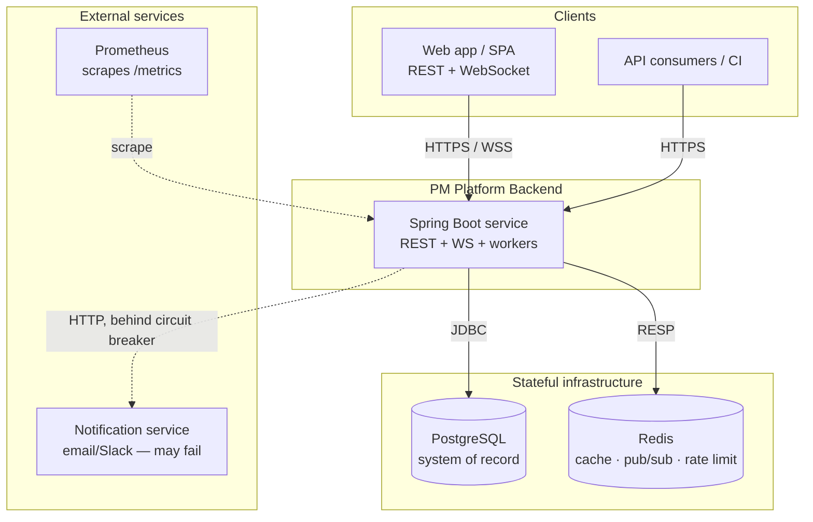
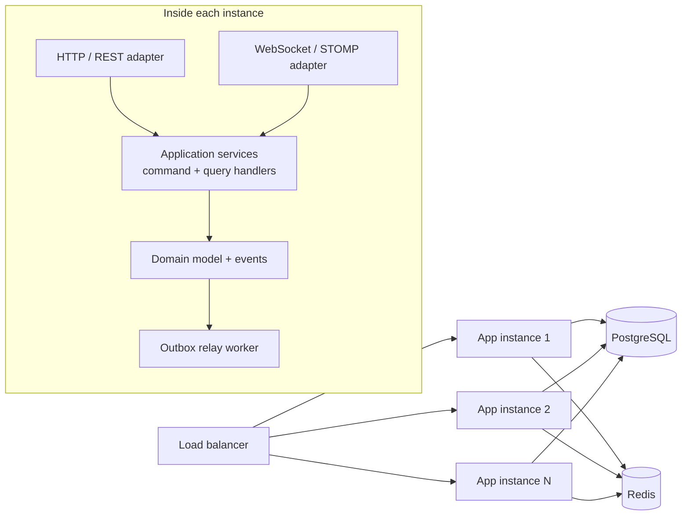
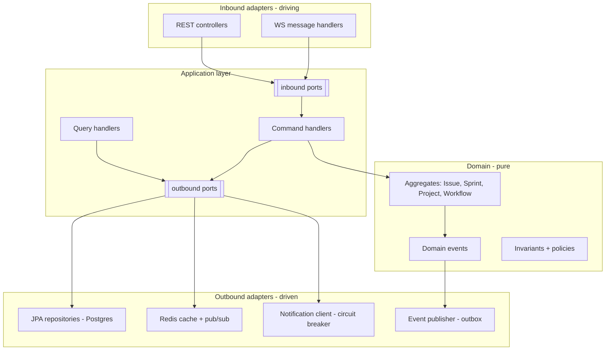
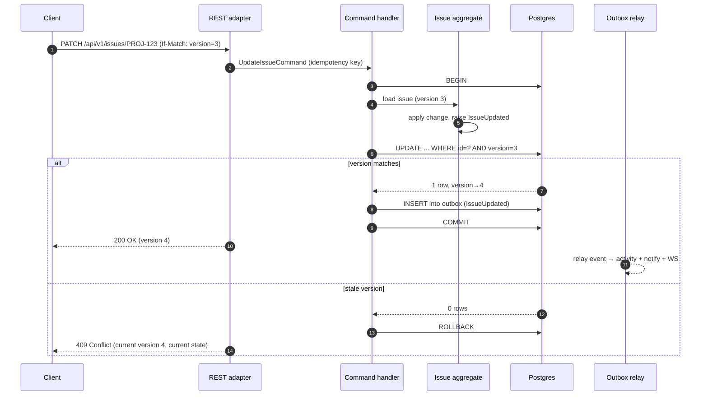
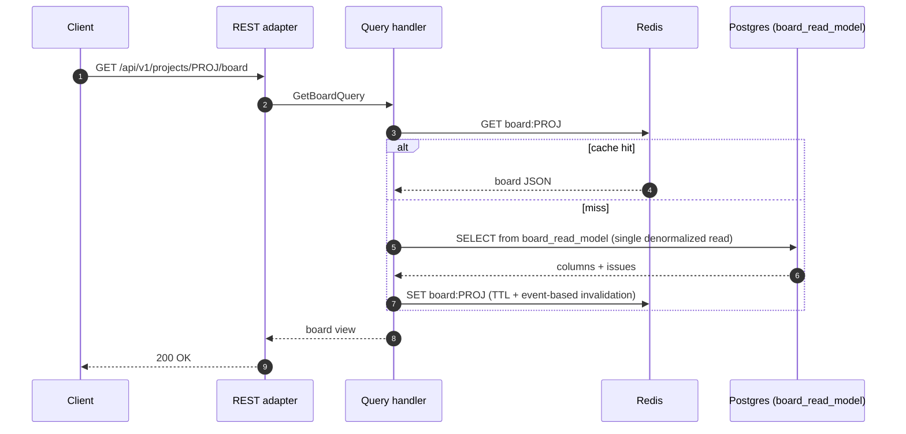
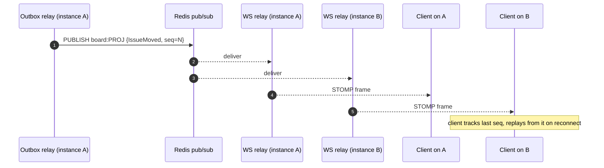
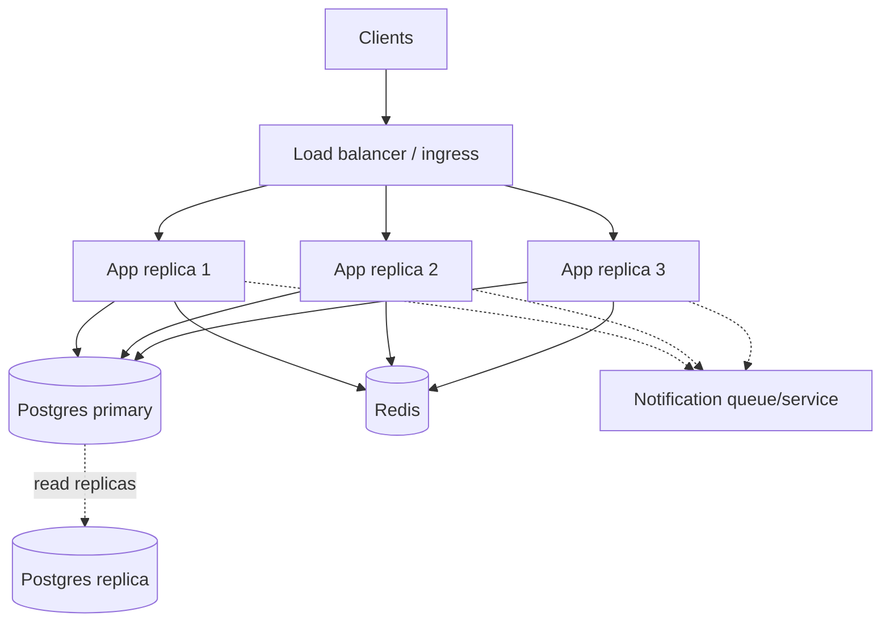

# High-Level Design (HLD)

> **Implementation status.** Built & tested: the hexagonal layering, CQRS board read model,
> transactional outbox + event relay, and the command/query/event flows below. Designed, not in
> code: the **Redis board-state cache** (the board is served from the `issue_board_view` table, not a
> cache), presence, and the sharding / horizontal-scaling plan (§7). Code: `org.example.{domain,
> application, adapter, config}`.

Backend for a Jira-like project management platform: projects, issues (Epic→Story→Sub-task),
sprints, a configurable workflow engine, collaboration (comments, mentions, watchers,
notifications), real-time board sync, and search — built to senior-level standards for
concurrency, integrity, observability, and scale.

> Companion docs: **[data-model.md](data-model.md)** for the schema, **[../adr/](../adr/)** for the
> reasoning behind every decision referenced here, and the per-subsystem **LLDs** for mechanics.

---

## 1. Architectural drivers

These are the forces that shape the design. Everything below traces back to one of them.

| # | Driver | Architectural implication |
|---|------------------------------|---------------------------|
| D1 | ~500+ concurrent users / workspace; 100 concurrent board viewers | Stateless app tier, horizontal scale, fast board reads (cache + read model) |
| D2 | Real-time board updates | Event-driven core; WebSocket fan-out decoupled from request handling |
| D3 | Data integrity under concurrency | Optimistic locking; explicit transaction boundaries; advisory locks for critical sections |
| D4 | Configurable workflows with rules | A workflow engine as a first-class domain concept, not hard-coded statuses |
| D5 | Resilience when dependencies fail | Circuit breakers, async/queued side-effects, graceful degradation |
| D6 | Auditability + observability | Domain events as the source of truth for audit/activity; correlation IDs end-to-end |
| D7 | Senior-level structure | Hexagonal architecture + CQRS to keep domain logic pure and reads fast |

---

## 2. System context



**Actors & roles** (RBAC): `Admin`, `Project Lead`, `Member`, `Viewer`. Authorization is
enforced at the application boundary and again at the data layer (row-level scoping). See
[security LLD](../lld/security.md) (planned).

The **notification service** is modeled as an *external* dependency precisely because a notification outage
requires the board to keep working when it is down — so it sits behind a circuit breaker and the
notification side-effect is asynchronous.

---

## 3. Container view

A single deployable service today, internally partitioned so it can be split later if needed.



Every instance is identical and **stateless** (no session affinity required — see §7). Redis is the
shared backplane for cache, rate limiting, presence, and the WebSocket pub/sub relay.

---

## 4. Architectural style

Three patterns combine. Each is justified in its own ADR.

### 4.1 Hexagonal (ports & adapters) — [ADR-0001](../adr/0001-hexagonal-architecture.md)

The domain is framework-free and depends on nothing outward. Everything that talks to the outside
world is an adapter behind a port (interface).



**Package structure** (under `org.example`):

```
org.example
├── domain/                  # entities, value objects, domain events, ports (interfaces). No Spring.
│   ├── issue/  sprint/  project/  workflow/  user/  comment/  shared/
├── application/             # use-case orchestration; transaction boundaries live here
│   ├── command/             # write side: <UseCase>Handler
│   ├── query/               # read side: query services over read models
│   └── port/                # inbound + outbound port interfaces
├── adapter/
│   ├── in/web/              # REST controllers, DTOs, error mapping, request validation
│   ├── in/ws/               # STOMP handlers, presence
│   ├── out/persistence/     # JPA entities, repositories, advisory-lock helpers, FTS queries
│   ├── out/cache/           # Redis cache + pub/sub relay
│   └── out/notification/    # external notification client (Resilience4j-wrapped)
└── config/                  # Spring wiring, security, observability, OpenAPI
```

> Note the JPA `@Entity` classes live in `adapter/out/persistence`, **separate** from the domain
> aggregates. This keeps the domain free of ORM concerns; mappers translate between them. The
> trade-off (extra mapping code) is accepted in [ADR-0001](../adr/0001-hexagonal-architecture.md).

### 4.2 CQRS — [ADR-0005](../adr/0005-cqrs-read-model.md)

Writes and reads have very different shapes here. The **write side** processes commands against
locked aggregates with full invariant checking. The **read side** — especially the board view,
the hottest query (D1) — serves from a **denormalized read model** kept in sync by domain events,
avoiding N+1 joins across issues/assignees/sprints/custom-fields on every board load.

This is "CQRS-lite": same database, separate models/tables, not separate services or event-sourcing.

### 4.3 Event-driven core — [ADR-0006](../adr/0006-domain-events-outbox.md)

Every mutation emits a **domain event** (`IssueCreated`, `StatusChanged`, `CommentAdded`,
`SprintCompleted`, …). Events are persisted in the **same transaction** as the state change (a
**transactional outbox**), then relayed asynchronously to three consumers:

1. **Activity feed / audit log** projector
2. **Notification** dispatcher — behind the circuit breaker
3. **WebSocket broadcaster** via Redis pub/sub

This decoupling is what lets board operations succeed even when notifications are down, and
gives us a single, ordered, replayable event stream that doubles as the audit trail and the source
for missed-event replay on WS reconnect.

---

## 5. Key runtime flows

### 5.1 Write command — update an issue (optimistic locking)



Detail in [concurrency LLD](../lld/concurrency.md) (planned).

### 5.2 Board read (CQRS read model + cache)



### 5.3 Real-time broadcast



Because events carry a monotonic per-project sequence and are persisted in the event log, a client
that reconnects can request everything after its last-seen sequence — **missed-event replay**.

### 5.4 Sprint completion and the circuit breaker

- **Sprint start/complete** acquire a **Postgres advisory lock** keyed by sprint so two concurrent
  "complete" calls can't double-process carry-over or corrupt velocity ([ADR-0008](../adr/0008-advisory-locks-sprint-ops.md)).
- The **notification dispatcher** calls the external service through a **Resilience4j circuit
  breaker**. After a configured failure threshold it opens, board operations continue unaffected,
  and notifications are queued for delivery on recovery. See [observability LLD](../lld/observability.md) (planned).

---

## 6. Cross-cutting concerns

| Concern | Approach | Where |
|---------|----------|-------|
| **Error model** | Typed exception hierarchy → consistent JSON (`type`, `title`, `status`, `detail`, `correlationId`), RFC 9457 problem+json. 409 for conflicts, 422 for invalid transitions | [api-design LLD](../lld/api-design.md) |
| **Correlation IDs** | Filter assigns/propagates `X-Correlation-Id`; bound to logging MDC + included in every error and event | [observability LLD](../lld/observability.md) |
| **Idempotency** | `Idempotency-Key` header on mutations; first result cached and replayed on retry | [concurrency LLD](../lld/concurrency.md) |
| **API versioning** | URI prefix `/api/v1`; additive changes only within a version | [ADR-0012](../adr/0012-api-versioning.md) |
| **Security** | Spring Security; RBAC roles + row-level project scoping; rate limiting via Redis | [security LLD](../lld/security.md) |
| **Validation** | Bean Validation at the edge; domain invariants in aggregates (defense in depth) | api-design / domain |
| **Observability** | Actuator health probes, Micrometer→Prometheus metrics, structured logs | [observability LLD](../lld/observability.md) |

---

## 7. Deployment & scaling view



**What is stateless vs stateful:**

| Component | State | Scaling approach |
|-----------|-------|------------------|
| App instances | **Stateless** | Add replicas behind the LB. No session stickiness needed |
| WebSocket sessions | Connection held by one instance, but **no shared state** there | Events fan out via Redis pub/sub so any instance can serve any client; presence kept in Redis |
| PostgreSQL | **Stateful** — system of record | Vertical first; read replicas for board/search reads; partition/shard by `workspace_id` when a single primary is exhausted |
| Redis | **Stateful** — ephemeral/derived | Clustered; data here is cache/derived and reconstructible |

**Sharding strategy (documented, not built):** the natural shard key is `workspace_id` (a.k.a.
organization). All queries are already workspace-scoped for row-level security, so the same key
partitions cleanly with minimal cross-shard queries. Search and the activity feed are
workspace-local. Cross-workspace operations (admin/global search) are rare and handled by scatter-gather.

**Graceful shutdown:** Spring's graceful shutdown drains in-flight HTTP requests; the WS
adapter stops accepting new connections and flushes; the outbox relay finishes its current batch.
Configured via `server.shutdown=graceful` + `spring.lifecycle.timeout-per-shutdown-phase`.

---

## 8. Technology choices (summary)

| Layer | Choice | ADR |
|-------|--------|-----|
| Runtime / framework | Java 21, Spring Boot 3.5.x | [0002](../adr/0002-spring-boot-3.5-over-4.0.md) |
| System of record | PostgreSQL | [0003](../adr/0003-postgresql-primary-store.md) |
| Cache / pub-sub / rate limit | Redis | [0004](../adr/0004-redis-roles.md) |
| Architecture | Hexagonal | [0001](../adr/0001-hexagonal-architecture.md) |
| Read path | CQRS read model | [0005](../adr/0005-cqrs-read-model.md) |
| Mutation propagation | Domain events + transactional outbox | [0006](../adr/0006-domain-events-outbox.md) |
| Concurrency | Optimistic locking | [0007](../adr/0007-optimistic-locking.md) |
| Critical sections | Advisory locks | [0008](../adr/0008-advisory-locks-sprint-ops.md) |
| Retry safety | Idempotency keys | [0009](../adr/0009-idempotency-keys.md) |
| Real-time | WebSocket/STOMP + Redis relay + replay | [0010](../adr/0010-websocket-stomp-realtime.md) |
| Search | PostgreSQL full-text search | [0011](../adr/0011-postgres-full-text-search.md) |
| Issue hierarchy | Single-table + type discriminator | [0013](../adr/0013-issue-type-modeling.md) |
| Custom fields | JSONB-backed | [0014](../adr/0014-custom-fields-jsonb.md) |

---

## 9. Capability → component traceability

| Area | Primary component(s) |
|------|----------------------|
| Data model & storage | `domain/*`, `adapter/out/persistence`, Flyway migrations, `activity_log` |
| Issue & workflow engine | `domain/workflow`, `domain/sprint`, command handlers |
| Collaboration | `domain/comment`, event projectors, notification dispatcher |
| Real-time sync | `adapter/in/ws`, Redis pub/sub relay, event log replay |
| Search & filtering | `adapter/out/persistence` (FTS), query handlers |
| Architecture | the hexagonal + CQRS + event structure itself |
| Concurrency & integrity | optimistic locking, advisory locks, idempotency, tx boundaries |
| Observability & reliability | Actuator, Micrometer, Resilience4j, graceful shutdown |
| Performance & scaling | Redis cache, read model, pooling, k6 load test, this §7 |
| Security & access control | Spring Security, RBAC, row-level scoping, rate limiting |