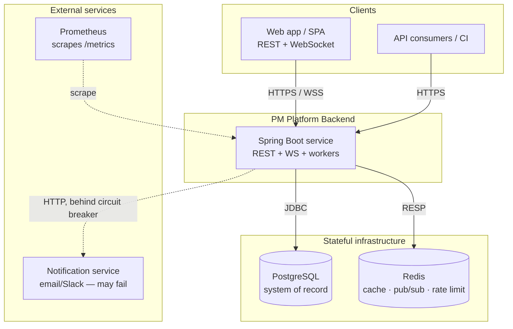
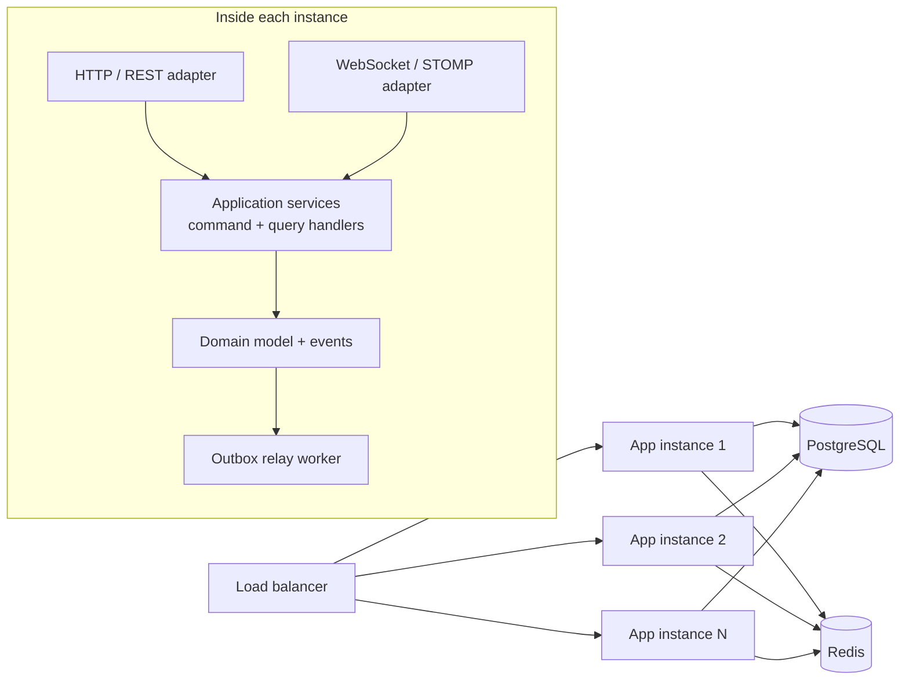
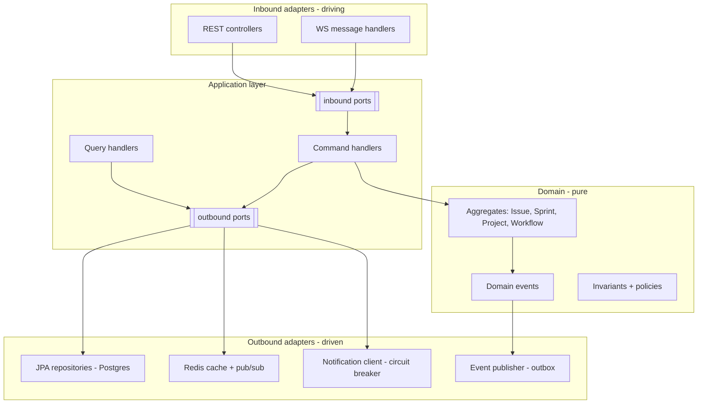
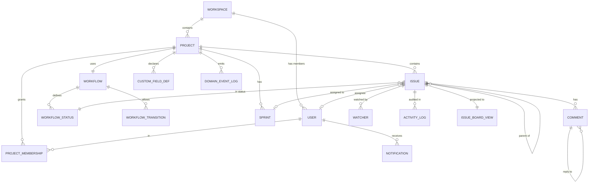
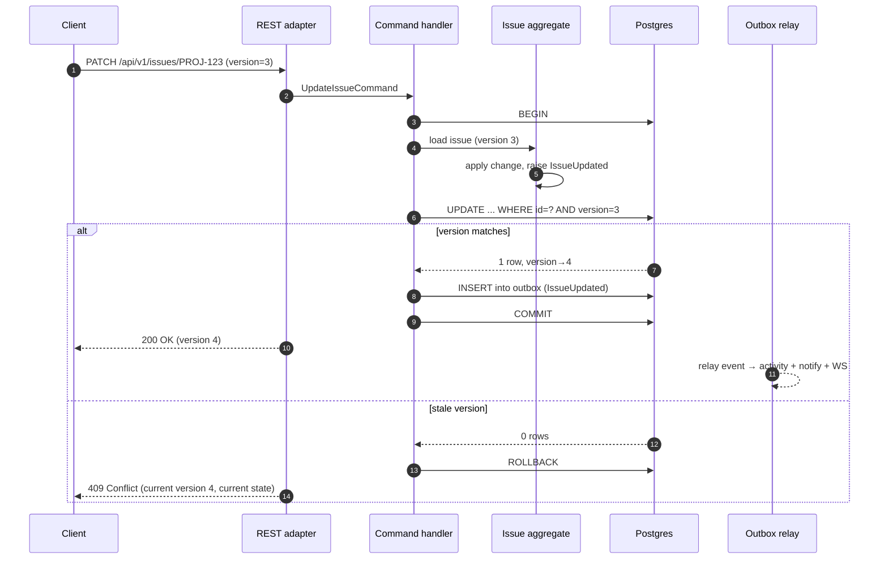
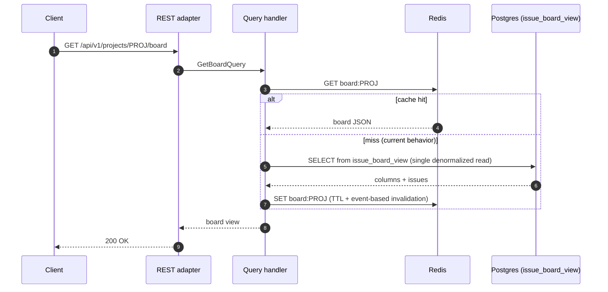
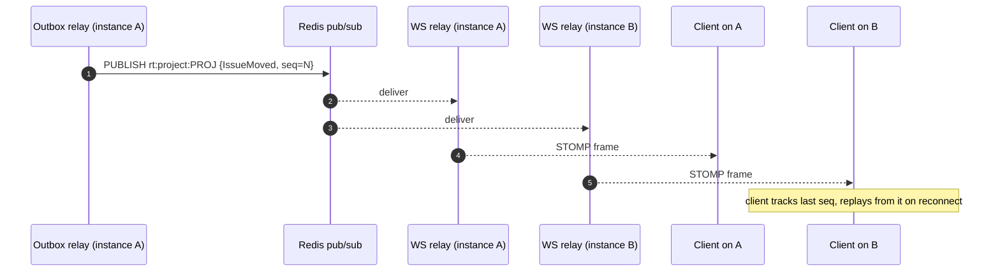
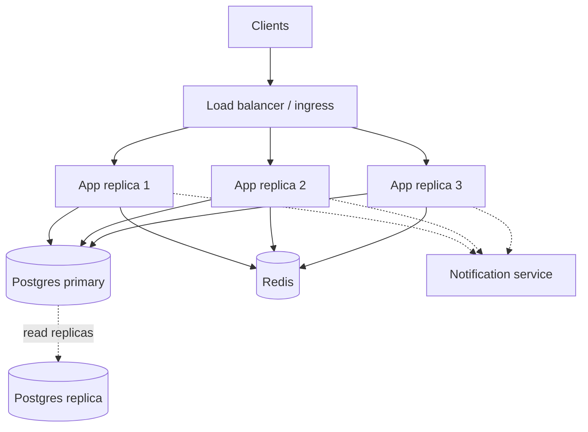

# High-Level Design

Backend for a Jira-like project management platform: projects, issues (Epic → Story → Sub-task),
sprints, a configurable workflow engine, collaboration (comments, mentions, watchers, notifications),
real-time board sync, and search — built for concurrency, integrity, observability, and horizontal
scale.

This is the single design document for the system; the reasoning behind each choice it references
lives in **[decisions.md](decisions.md)**.

> **Implementation status.** Built and tested: the hexagonal layering, the CQRS board read model, the
> transactional outbox and event relay, the workflow and sprint engine, optimistic and advisory
> locking, real-time STOMP broadcast with replay, full-text search, JWT auth with per-project RBAC and
> rate limiting, and the notification circuit breaker. Designed but not yet implemented: the Redis
> board-state cache (the board is served from the `issue_board_view` table), presence, the
> comments/watchers APIs, idempotency-key handling, custom-field validation, and Postgres-level RLS.
> Code lives under `org.example.{domain, application, adapter, config}`.

---

## 1. Architectural drivers

These are the forces that shape the design; everything below traces back to one of them.

| #  | Driver | Architectural implication |
|----|--------|---------------------------|
| D1 | ~500+ concurrent users per workspace; 100 concurrent board viewers | Stateless app tier, horizontal scale, fast board reads from a read model |
| D2 | Real-time board updates | Event-driven core; WebSocket fan-out decoupled from request handling |
| D3 | Data integrity under concurrency | Optimistic locking; explicit transaction boundaries; advisory locks for critical sections |
| D4 | Configurable workflows with rules | A workflow engine as a first-class domain concept, not hard-coded statuses |
| D5 | Resilience when dependencies fail | Circuit breakers, asynchronous side-effects, graceful degradation |
| D6 | Auditability and observability | Domain events as the source of truth for audit/activity; correlation IDs end-to-end |
| D7 | Clean separation of concerns | Hexagonal architecture + CQRS to keep domain logic pure and reads fast |

---

## 2. System context



**Actors and roles** (RBAC): `Admin`, `Project Lead`, `Member`, `Viewer`. Authorization is enforced
at the application boundary and again at the data layer (row-level project scoping).

The **notification service** is modeled as an *external* dependency precisely because the board must
keep working when it is down — so it sits behind a circuit breaker and the notification side-effect is
asynchronous.

---

## 3. Container view

A single deployable service today, internally partitioned so it can be split later if needed.



Every instance is identical and **stateless** — no session affinity required (see §9). Redis is the
shared backplane for cache, rate limiting, presence, and the WebSocket pub/sub relay.

---

## 4. Architectural style

Three patterns combine; the rationale for each is in [decisions.md](decisions.md).

### 4.1 Hexagonal (ports & adapters)

The domain is framework-free and depends on nothing outward. Everything that talks to the outside
world is an adapter behind a port (interface).



**Package structure** (under `org.example`):

```
org.example
├── domain/                  # entities, value objects, domain events, ports. No Spring.
│   ├── issue/  sprint/  project/  workflow/  shared/
├── application/             # use-case orchestration; transaction boundaries live here
│   ├── command/             # write side: <UseCase>Service
│   ├── query/               # read side: query services over read models
│   └── port/out/            # outbound port interfaces
├── adapter/
│   ├── in/web/              # REST controllers, DTOs, error mapping, request validation
│   ├── in/ws/               # STOMP handlers
│   ├── out/persistence/     # JPA entities, repositories, advisory-lock helpers, FTS queries
│   ├── out/events/          # outbox relay + projectors
│   └── out/notification/    # external notification client (Resilience4j-wrapped)
└── config/                  # Spring wiring, security, observability, OpenAPI
```

The JPA `@Entity` classes live in `adapter/out/persistence`, **separate** from the domain aggregates;
mappers translate between them. This keeps the domain free of ORM concerns at the cost of a little
mapping code.

### 4.2 CQRS

Writes and reads have very different shapes here. The **write side** processes commands against locked
aggregates with full invariant checking. The **read side** — especially the board view, the hottest
query (D1) — serves from a **denormalized read model** (`issue_board_view`) kept in sync by domain
events, avoiding N+1 joins across issues/assignees/statuses/sprints on every board load. This is
"CQRS-lite": same database, separate tables, not separate services or event sourcing.

### 4.3 Event-driven core

Every mutation emits a **domain event** (`IssueCreated`, `StatusChanged`, `SprintCompleted`, …).
Events are persisted in the **same transaction** as the state change (a **transactional outbox**),
then relayed asynchronously to three consumers:

1. the **activity feed / audit log** projector,
2. the **notification** dispatcher — behind the circuit breaker,
3. the **WebSocket broadcaster** via Redis pub/sub.

This decoupling is what lets board operations succeed even when notifications are down, and gives a
single ordered, replayable event stream that doubles as the audit trail and the source for
missed-event replay on WebSocket reconnect.

---

## 5. Data model

PostgreSQL is the system of record. The full DDL is delivered as Flyway migrations under
`src/main/resources/db/migration` (`V1`–`V6`, plus a repeatable demo seed); `ddl-auto=validate` means
Flyway owns the schema and Hibernate only checks the entities match it, so drift fails at startup.



**Core tables.** `workspaces` (top-level tenant and shard key) → `users`, `projects`;
`project_memberships` (the `(project, user, role)` rows that drive RBAC and row-level scoping);
`workflows` / `workflow_statuses` / `workflow_transitions` (the configurable workflow, as data);
`sprints`, `issues` (all types, with `parent_id`, `version`, `custom_fields jsonb`, and a generated
`search_vector`), `comments`, `watchers`; `custom_field_defs`, `activity_log`, `notifications`;
`domain_event_log` (the outbox and ordered replay stream) and `idempotency_keys`; and
`issue_board_view` (the CQRS projection).

**Modeling decisions** (full reasoning in [decisions.md](decisions.md)):

- **Single-table issues** — one `issues` table with a `type` discriminator and self-referencing
  `parent_id`; hierarchy *rules* live in the domain.
- **Custom fields as JSONB** — `issues.custom_fields`, declared per project in `custom_field_defs`,
  GIN-indexable; the issue stays one row.
- **Event-sourced audit** — `activity_log` is append-only, written by the same projector that feeds
  notifications and WebSockets, so the feed and audit trail are consistent with what happened and
  carry the originating `correlation_id`.
- **CQRS read model** — `issue_board_view` is a flat, denormalized projection the board reads instead
  of joining 4–5 tables per load; it carries `version` so a stale client can detect a missed update.

**Indexing & pagination.** Indexes follow the actual query patterns: `(project_id, status_id, rank)`
on the board view; `(project_id, sprint_id)` and a partial backlog index on issues; `(assignee_id)`,
`(parent_id)`; **GIN** on the two `search_vector` columns and on `issues.custom_fields`;
`(project_id, created_at DESC, id)` on `activity_log`; a partial `WHERE published_at IS NULL` index for
the outbox poll. Unbounded lists (issues, search, activity, notifications) use **keyset/cursor**
pagination (`WHERE (sort_key, id) < (:cursor) ORDER BY … LIMIT :n+1`) to stay O(page) regardless of
offset.

---

## 6. Key runtime flows

### 6.1 Write command — update an issue (optimistic locking)



### 6.2 Board read (CQRS read model + cache)



*(The Redis board cache is designed; today the board is served directly from `issue_board_view`.)*

### 6.3 Real-time broadcast



Because events carry a monotonic per-project sequence and are persisted in the event log, a client
that reconnects can request everything after its last-seen sequence — **missed-event replay**.

### 6.4 Sprint completion and the circuit breaker

- **Sprint start/complete** acquire a **Postgres advisory lock** keyed by sprint so two concurrent
  "complete" calls can't double-process carry-over or corrupt velocity.
- The **notification dispatcher** calls the external service through a **Resilience4j circuit
  breaker**. After a configured failure threshold it opens, board operations continue unaffected, and
  notifications are persisted `PENDING` for delivery on recovery.

---

## 7. Subsystem mechanics

The shape of each subsystem; the code under `domain/` and `adapter/` has the full detail.

**Workflow engine.** Statuses and transitions are *rows*, configurable per project: a
`workflow_status` has a `category` (`TODO` / `IN_PROGRESS` / `DONE`), a board `position`, and an
optional `wip_limit`; a `workflow_transition` has `from`/`to` statuses plus declarative `guard` and
`post_action` JSON. A transition loads the issue and workflow, resolves the current→target transition
(none → **422** with the list of allowed transitions), evaluates guards (`requireAssignee`,
`requireFields`, `blockIfChildrenOpen`, `wipLimit`), applies the status change under the issue's
optimistic lock, and emits `StatusChanged`. Declarative post-actions (assign reviewer, notify) are
modeled in the schema; synchronous ones are designed, async ones ride the event stream.

**Sprints.** States `FUTURE → ACTIVE → CLOSED`, at most one `ACTIVE` per project. Issues move between
backlog and a sprint by setting `issues.sprint_id`. Completion runs under the sprint advisory lock:
it finds the not-`DONE` issues, carries the client-selected ones forward (to the next sprint or the
backlog), computes **velocity** as the sum of story points of `DONE` issues, sets `CLOSED`, and emits
`SprintCompleted`.

**Concurrency & integrity.** Optimistic `version` columns (409 on conflict, with current state);
transaction-scoped advisory locks for the multi-row sprint critical section and for WIP-limit checks;
atomic issue-key allocation (`UPDATE projects SET issue_seq = issue_seq + 1 … RETURNING`, backstopped
by a unique constraint). Each command handler is the transaction boundary, writing the state change
and the outbox event together.

**Real-time.** STOMP over WebSocket at `/ws`, JWT validated on the CONNECT frame; topics
`/topic/projects/{id}/board` (membership enforced on subscribe). The outbox relay publishes to Redis
pub/sub; every instance forwards to its locally-connected sessions. Events carry the per-project `seq`;
`GET /api/v1/projects/{id}/events?after={seq}` replays the gap (at-least-once delivery, clients dedupe
by `seq`). Presence (Redis sets with TTL) is designed.

**Search.** Generated `tsvector` columns (issues: title^A + description^B; comments: body), GIN-indexed
and queried with `websearch_to_tsquery`; comment hits resolve to the parent issue. Structured filters
(`status`, `assignee`, `type`, …) come in as query params, compile to parameterized SQL against a
field whitelist (the injection defense), combine with the full-text predicate and keyset pagination,
and are always scoped to the caller's projects.

**Observability & resilience.** Actuator liveness/readiness probes (readiness includes Postgres and
Redis; an open breaker does *not* fail readiness); Micrometer → Prometheus metrics (HTTP-latency
histograms, Hikari pool, WS connections, outbox lag, breaker state); a correlation-id filter that
binds an id to the logging MDC, echoes it, and stamps it onto every event. The notification breaker is
`COUNT_BASED` (window 10, opens at 50% failures, 30 s open, 3 half-open trials); its fallback persists
the notification `PENDING`. Graceful shutdown drains HTTP, closes WebSocket sessions, and lets the
relay finish its batch.

**Security.** Stateless JWT (bcrypt passwords; minimal claims; algorithm key from env). Roles are
*not* in the token — they are resolved per request from `project_memberships`, so changes take effect
immediately. Four per-project roles (Viewer → Member → Project Lead → Admin) gate actions; a project
access resolver injects `WHERE project_id = ANY(:myProjects)` into list/search/board/activity queries
(direct fetches check membership), and the same resolver guards WebSocket subscriptions. A Redis
token-bucket rate limiter (per user, per endpoint class) returns 429 with `Retry-After`. DTO→domain
mapping blocks mass assignment of server-controlled fields (`version`, `reporter`, timestamps).

---

## 8. Cross-cutting concerns

| Concern | Approach |
|---------|----------|
| **Error model** | Typed exception hierarchy → RFC 9457 `application/problem+json` from one `@RestControllerAdvice`: 400 validation, 401 auth, 403 not-a-member, 404 not found, **409** stale `version` (body includes `current`), **422** illegal transition/guard (body lists `allowedTransitions`) and business-rule violations, 429 rate limit. Every body carries the correlation id. |
| **Correlation IDs** | A filter assigns/propagates `X-Correlation-Id`, binds it to the logging MDC, echoes it on the response, and stamps it onto every event and audit row. |
| **Idempotency** | *(Designed.)* `Idempotency-Key` header on mutations; first result stored and replayed on retry. |
| **API versioning** | URI prefix `/api/v1`; additive changes only within a version. |
| **Validation** | Bean Validation at the edge; domain invariants in the aggregates (defense in depth). |
| **API docs** | springdoc OpenAPI at `/v3/api-docs`, Swagger UI at `/swagger-ui.html`. |

---

## 9. Deployment & scaling



| Component | State | Scaling approach |
|-----------|-------|------------------|
| App instances | **Stateless** | Add replicas behind the load balancer; no session stickiness |
| WebSocket sessions | A connection is held by one instance, but with **no shared state** there | Events fan out via Redis pub/sub so any instance can serve any client; presence kept in Redis |
| PostgreSQL | **Stateful** — system of record | Vertical first; read replicas for board/search reads; partition/shard by `workspace_id` when one primary is exhausted |
| Redis | **Stateful** — ephemeral/derived | Clustered; everything here is cache/derived and reconstructible |

**Sharding strategy** (documented, not built): the natural shard key is `workspace_id`. All queries
are already workspace-scoped for row-level security, so the same key partitions cleanly with minimal
cross-shard queries; cross-workspace operations (admin/global search) are rare and handled by
scatter-gather.

**Graceful shutdown:** Spring drains in-flight HTTP requests; the WebSocket adapter stops accepting
connections and flushes; the outbox relay finishes its current batch — configured via
`server.shutdown=graceful` and `spring.lifecycle.timeout-per-shutdown-phase`.

---

## 10. Technology choices

| Layer | Choice |
|-------|--------|
| Runtime / framework | Java 21, Spring Boot 3.5.x |
| System of record | PostgreSQL (Flyway migrations) |
| Cache / pub-sub / rate limit | Redis |
| Architecture | Hexagonal + CQRS + event-driven outbox |
| Concurrency | Optimistic locking + advisory locks |
| Real-time | WebSocket/STOMP + Redis relay + event replay |
| Search | PostgreSQL full-text search (`tsvector`/GIN) |
| Resilience | Resilience4j circuit breaker |
| Observability | Actuator, Micrometer + Prometheus |
| Security | Spring Security, JWT, per-project RBAC |
| Testing | JUnit 5, Testcontainers |

The reasoning behind these choices is in **[decisions.md](decisions.md)**.
