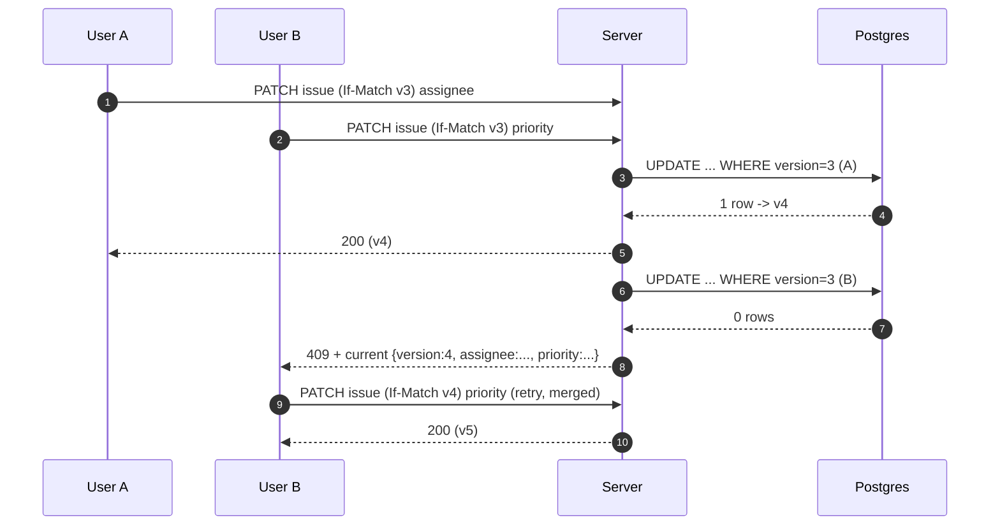
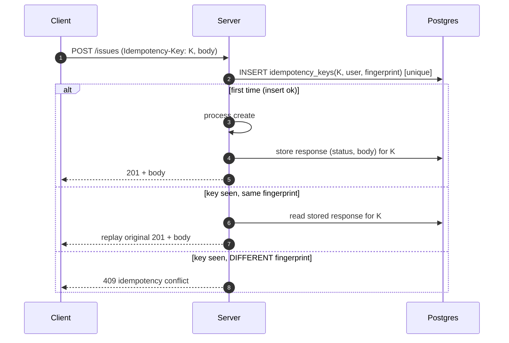

# LLD: Concurrency & Data Integrity

> **Implementation status.** Built & tested: optimistic locking, advisory locks for sprint
> operations, WIP-limit enforcement, atomic issue-key allocation, and explicit transaction
> boundaries. Designed, not in code: idempotency keys (the `idempotency_keys` table exists; no
> handler yet). Code: `application/command`, `adapter/out/persistence/AdvisoryLockAdapter`.

- **Related:** [ADR-0007 optimistic locking](../adr/0007-optimistic-locking.md), [ADR-0008 advisory locks](../adr/0008-advisory-locks-sprint-ops.md), [ADR-0009 idempotency](../adr/0009-idempotency-keys.md)

Four mechanisms, each matched to the shape of the contention it guards.

| Concern | Mechanism | Why this one |
|---------|-----------|--------------|
| Concurrent single-issue edits | Optimistic locking (`version`) | Low contention; no lock held across think-time |
| Multi-row sprint start/complete | Advisory transaction lock | Guards an invariant spanning many rows |
| Retried mutations | Idempotency keys | Safe POST/transition retries |
| WIP limit under concurrent moves | Advisory lock + re-check | Check-then-act is a race |
| Issue key allocation | Atomic `UPDATE ... RETURNING` | Gapless-enough, no extra lock |

---

## 1. Optimistic locking

`issues` and `sprints` carry `version bigint`. The write is conditional:

```sql
UPDATE issues SET ..., version = version + 1, updated_at = now()
WHERE id = :id AND version = :expectedVersion;
-- 0 rows affected  ->  someone else won  ->  OptimisticLockConflictException -> 409
```

JPA `@Version` does this automatically, but we surface the **current state** in the 409 body so the
client can merge and retry:



**Why not pessimistic:** `SELECT ... FOR UPDATE` would hold a row lock across the user's edit
think-time, causing lock waits/deadlocks under interactive editing. Optimistic fits the low-conflict
edit pattern of interactive issue editing ([ADR-0007](../adr/0007-optimistic-locking.md)).

---

## 2. Advisory locks for critical sections

Multi-row operations use a **transaction-scoped** advisory lock — held to `COMMIT`/`ROLLBACK`,
auto-released even on crash:

```sql
-- key derived deterministically from the entity id (UUID -> bigint)
SELECT pg_advisory_xact_lock(:lockKey);
```

```java
// outbound port — implemented once, used by sprint start/complete and WIP moves
interface AdvisoryLock { void acquireXact(LockNamespace ns, UUID entityId); }
// key = hash64(ns.ordinal(), entityId)  -> stable across instances; namespaced to avoid collisions
```

Used for **sprint start/complete** (the whole carry-over + velocity computation runs under the lock,
[workflow LLD §3](workflow-engine.md)) and for **WIP enforcement** (§4). Centralized in the
application service so no code path can bypass it ([ADR-0008](../adr/0008-advisory-locks-sprint-ops.md)).

---

## 3. Idempotency keys



- **Fingerprint** = hash(method + path + canonical body); detects accidental key reuse with a
  different request.
- **Concurrent duplicates** (two requests, same key, racing): the `UNIQUE (user_id, key)` constraint
  lets exactly one win the INSERT; the loser waits/reads and replays the stored response (or returns
  `409 in-progress` if not yet stored).
- **TTL**: keys expire (`expires_at`); a scheduled job prunes them.
- **Scope:** issue create, update, transition, sprint start/complete.

---

## 4. WIP-limit race

Two concurrent moves into a column at `wip_limit` can both pass a naive `count < limit` check
(check-then-act). Fix: serialize moves **into a given column** and re-check under the lock.

```java
// only when the target status has a wip_limit
advisoryLock.acquireXact(WIP, statusId);          // serialize per (project,status)
long inColumn = issues.countByStatus(statusId);   // read under lock
if (inColumn >= status.wipLimit())
    throw new BusinessRuleException("WIP limit reached for '" + status.name() + "'"); // 422
// ... apply move (optimistic lock on the issue) ...
```

Lock contention is scoped to WIP-limited columns only; unlimited columns take no lock. The issue
itself is still updated under its own optimistic lock, so the two mechanisms compose.

---

## 5. Issue key allocation

`PROJ-123` numbers must be unique per project under concurrent creates. A single atomic statement
avoids a separate lock:

```sql
UPDATE projects SET issue_seq = issue_seq + 1 WHERE id = :projectId RETURNING issue_seq;
```
The row-level lock Postgres takes for the `UPDATE` is held only for that statement, then the issue
is inserted with the returned `seq` and `key = projectKey || '-' || seq`. `UNIQUE (project_id, seq)`
is the backstop.

---

## 6. Transaction boundaries

- **One aggregate per transaction.** The application command handler is the transaction boundary
  (`@Transactional`), not the controller or repository.
- **State change + outbox event are written in the same transaction** → atomicity (an event exists
  iff the change committed, [ADR-0006](../adr/0006-domain-events-outbox.md)).
- **The read-model projection is updated by the outbox relay**, *after* commit — so reads are
  eventually consistent ([ADR-0005](../adr/0005-cqrs-read-model.md)); the write path returns the
  authoritative state directly for read-your-write within the same request.

| Operation | Atomic unit |
|-----------|-------------|
| Create/update/transition issue | issue row + outbox event |
| Sprint complete | sprint + carried issues + velocity + outbox event (under advisory lock) |
| Add comment | comment + outbox event |

---

## 7. Deadlock & ordering

- Advisory locks use a **fixed namespace + entity-id key scheme**, and a transaction acquires at
  most one such lock, so cross-lock ordering deadlocks can't arise.
- Optimistic locking takes **no** long-held DB locks, so it doesn't participate in deadlock cycles.
- Hikari pool sizing + statement timeouts bound worst-case waits (see [observability LLD](observability.md)).