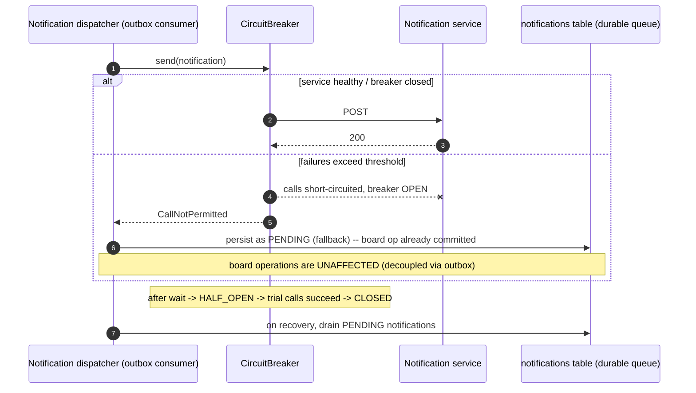

# LLD: Observability & Reliability

> **Implementation status.** Built: liveness/readiness probes (incl. db + redis), Prometheus
> metrics with HTTP-latency histograms, correlation IDs (filter → MDC → events), the notification
> circuit breaker, and graceful shutdown. Designed, not in code: JSON structured-logging
> output (correlation IDs are present) and custom metrics (WebSocket connection count, outbox lag).
> Code: `application.yml`, `adapter/in/web/CorrelationIdFilter`, `adapter/out/notification`.

- **Related:** [ADR-0006 outbox](../adr/0006-domain-events-outbox.md), [HLD §6,§7](../architecture/hld.md)

---

## 1. Correlation IDs (the spine)

A `OncePerRequestFilter` runs first on every request:
1. Read `X-Correlation-Id` from the request, or generate a UUID.
2. Put it in the **SLF4J MDC** (`correlationId`), plus `userId` and `projectId` once resolved.
3. Echo it back as a response header.
4. It is **persisted on every domain event** (`domain_event_log.correlation_id`) and copied into
   error bodies ([api-design §4](api-design.md)).

For WebSocket, the id is bound on the STOMP CONNECT frame. Result: one id ties together the HTTP
request, its logs, the events it produced, the async work that consumed them, and any error returned.

---

## 2. Structured logging

JSON logs (Spring Boot 3.5 native `logging.structured.format.console`, ECS layout) so logs are
queryable in any aggregator. Every line carries the MDC fields:

```jsonc
{ "@timestamp":"…", "level":"INFO", "logger":"…IssueCommandHandler",
  "message":"issue transitioned", "correlationId":"…", "userId":"…",
  "projectId":"…", "issueKey":"PROJ-123", "from":"To Do", "to":"In Progress" }
```

Conventions: INFO for state changes/commands, WARN for handled degradations (circuit open,
optimistic conflict), ERROR for unexpected failures (with correlationId, never leaking secrets/PII).

---

## 3. Health probes

Actuator, with Kubernetes-style probes split (configured in `application.yml`):

| Endpoint | Meaning | Composed of |
|----------|---------|-------------|
| `/actuator/health/liveness` | Process is alive (don't restart unless this fails) | `livenessState` |
| `/actuator/health/readiness` | Can serve traffic | `readinessState` + `db` + `redis` |

**Deliberate choice:** the notification circuit breaker being **open does *not* fail readiness** —
the system is healthy and serving; only a degraded side-effect is affected. Readiness reflects
hard dependencies (Postgres, Redis) only.

---

## 4. Metrics (Micrometer → Prometheus)

`/actuator/prometheus`. Beyond the built-ins (JVM, GC, HikariCP pool), the key metrics:

| Metric | Type | Purpose |
|--------|------|---------|
| `http.server.requests` (histogram) | timer | Request latency **percentiles** (p50/p95/p99), error rates |
| `hikaricp.connections.*` | gauge | DB pool saturation / query wait |
| `ws.connections.active` | gauge | **WebSocket connection count** |
| `outbox.lag` (unpublished events) | gauge | Event pipeline health |
| `outbox.published` | counter | Throughput |
| `resilience4j.circuitbreaker.*` | gauge/counter | CB state + call outcomes (auto via resilience4j-micrometer) |
| `search.query.duration` | timer | Search performance |

Latency-percentile histograms are enabled for `http.server.requests` in `application.yml`.

---

## 5. Circuit breaker — notification resilience

The notification client is wrapped with Resilience4j (`@CircuitBreaker` + `@Retry` + a fallback):

```yaml
resilience4j.circuitbreaker.instances.notification:
  sliding-window-type: COUNT_BASED
  sliding-window-size: 10
  failure-rate-threshold: 50        # opens after sustained failures (~5/10)
  wait-duration-in-open-state: 30s
  permitted-number-of-calls-in-half-open-state: 3
```



Because notifications are an **outbox consumer** ([ADR-0006](../adr/0006-domain-events-outbox.md)),
the board write already committed before the dispatcher runs — so an open breaker can never fail a
board operation. Undelivered notifications sit `PENDING` and are drained when the breaker closes.
This is the circuit breaker in action.

---

## 6. Graceful shutdown

On SIGTERM:
1. `server.shutdown=graceful` — stop accepting new HTTP requests, let in-flight ones finish.
2. WebSocket sessions are closed with a going-away frame so clients reconnect+replay elsewhere.
3. The outbox relay finishes its current batch and stops claiming new ones.
4. Hikari drains; bounded by `spring.lifecycle.timeout-per-shutdown-phase` (30s).

No request is cut mid-flight, and no event is half-relayed (the relay is idempotent on
`published_at`, so an interrupted batch is safely retried by the next instance).

---

## 7. Scope

Correlation-id logging, health probes, the Prometheus metrics above, the notification circuit
breaker with durable fallback, and graceful shutdown are implemented. Distributed tracing
(Micrometer Tracing/OpenTelemetry) is a documented extension — the correlation id is already the
seam it would plug into.