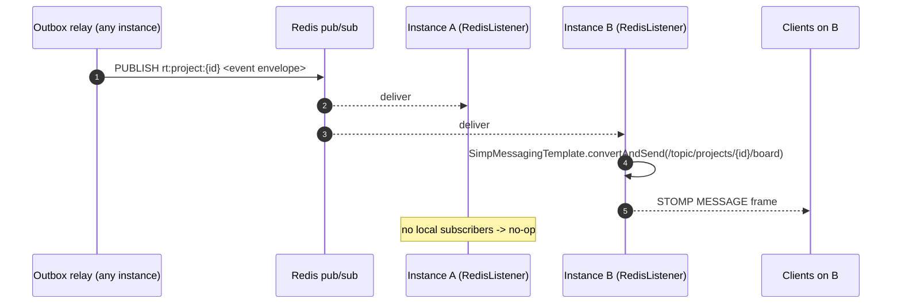
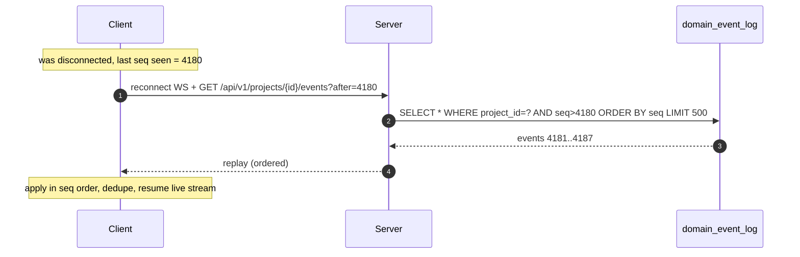

# LLD: Real-Time Sync

> **Implementation status.** Built & tested: STOMP broadcast over WebSocket, Redis pub/sub
> fan-out across instances, and missed-event replay (`GET …/events?after=`). Designed, not in
> code: presence tracking. Code: `config/WebSocketConfig`, `adapter/out/realtime`, `adapter/in/ws`,
> `adapter/in/web/EventReplayController`.

- **Related:** [ADR-0010 WebSocket/STOMP](../adr/0010-websocket-stomp-realtime.md), [ADR-0006 outbox](../adr/0006-domain-events-outbox.md), [ADR-0004 Redis](../adr/0004-redis-roles.md)

Real-time is a **consumer of the domain event stream**, not a separate write path. The outbox
([ADR-0006](../adr/0006-domain-events-outbox.md)) already produces ordered, persisted events; this
subsystem fans them out to clients and lets reconnecting clients catch up.

---

## 1. Transport & topics

STOMP over WebSocket ([ADR-0010](../adr/0010-websocket-stomp-realtime.md)). Connection endpoint
`/ws` (SockJS fallback optional). JWT is validated on the STOMP **CONNECT** frame.

| Destination | Purpose |
|-------------|---------|
| `/topic/projects/{projectId}/board` | Board changes for a project |
| `/topic/issues/{issueKey}` | Fine-grained updates for one open issue |
| `/topic/projects/{projectId}/presence` | Presence join/leave |
| `/user/queue/notifications` | Per-user notifications (assignments, mentions) |

**Subscription authorization:** a `ChannelInterceptor` on `SUBSCRIBE` checks the principal is a
member of the project (reuses the same membership check as REST, [security LLD](security.md)). A
non-member's subscribe is rejected — RLS extends to the socket.

---

## 2. Event envelope

Every broadcast shares one schema (derived from `domain_event_log`):

```jsonc
{
  "type": "issue_moved",            // issue_created|issue_updated|issue_moved|comment_added|sprint_updated
  "projectId": "…",
  "seq": 4187,                      // per-project monotonic — ordering + replay cursor
  "occurredAt": "2026-06-10T…Z",
  "correlationId": "…",
  "data": { "issueKey": "PROJ-123", "from": "To Do", "to": "In Progress", "version": 5 }
}
```

The five event types cover the full set of board mutations. `version` lets a client detect it
applied changes out of order and re-fetch if needed.

---

## 3. Cross-instance fan-out

With N stateless instances ([ADR-0004](../adr/0004-redis-roles.md)), the instance that *processed*
a mutation usually isn't the one holding a given client's socket. Redis pub/sub bridges them:



Implementation: a `RedisMessageListenerContainer` subscribes each instance to `rt:project:*`; on
message it calls `SimpMessagingTemplate.convertAndSend(destination, payload)` which delivers only to
that instance's locally-subscribed sessions. We use this application-level relay rather than Spring's
built-in simple broker (single-instance only) — and avoid an external STOMP broker (overkill).

---

## 4. Presence

"Who is viewing this board/issue", kept in Redis with TTL so crashes self-heal:

```
SADD  presence:project:{id} {userId}        (on subscribe)
SETEX presence:hb:{id}:{userId} 30s 1       (heartbeat; client pings every ~10s)
SREM  presence:project:{id} {userId}        (on unsubscribe / DISCONNECT / heartbeat expiry sweep)
```

Join/leave deltas are broadcast to `/topic/projects/{id}/presence`. A periodic sweep reconciles the
set against expired heartbeats (handles ungraceful disconnects).

---

## 5. Reconnection & missed-event replay

Because every event is durably stored with a per-project `seq`, replay is a simple range read — no
separate buffer to maintain ([ADR-0010](../adr/0010-websocket-stomp-realtime.md)):



- **At-least-once + dedupe**: live and replayed streams may overlap; the client dedupes by `seq`.
- **Bounded window**: events are retained for a configured period (e.g. 7 days). If a client's
  `after` is older than retention, the server responds `resync-required` and the client refetches
  the board snapshot, then resumes live.
- **Ordering**: the relay publishes in `seq` order per project; clients apply in `seq` order.

---

## 6. Reliability concerns

| Concern | Handling |
|---------|----------|
| Slow consumer / full send buffer | STOMP send time/buffer limits; on overflow, close with `resync-required` rather than blocking the relay |
| Duplicate delivery | Client dedupe by `(projectId, seq)` |
| Instance restart | Sockets reconnect; replay closes the gap; presence heartbeats expire and re-add |
| Event loss in Redis pub/sub (no persistence) | The **event log is the source of truth**; pub/sub is only the live hint. A missed pub/sub message is recovered by the next replay or a periodic "tip seq" the client compares against |

---

## 7. Scope

Implemented end-to-end: board-topic broadcast for the five event types via the Redis relay, and the
replay endpoint (the core real-time path). Presence and per-issue topics are a thin layer on top,
fully specified here.