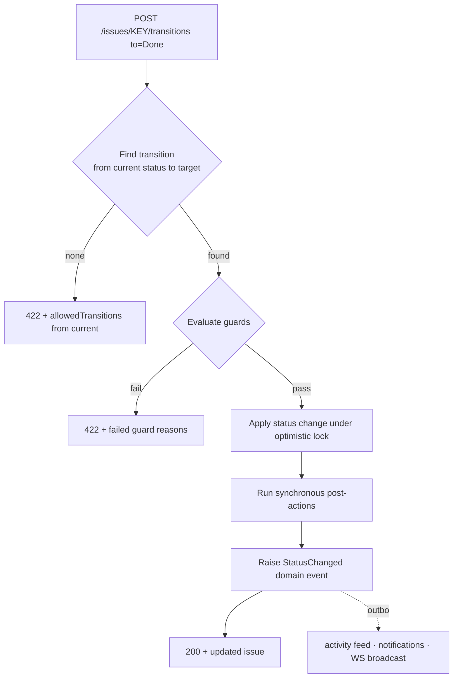
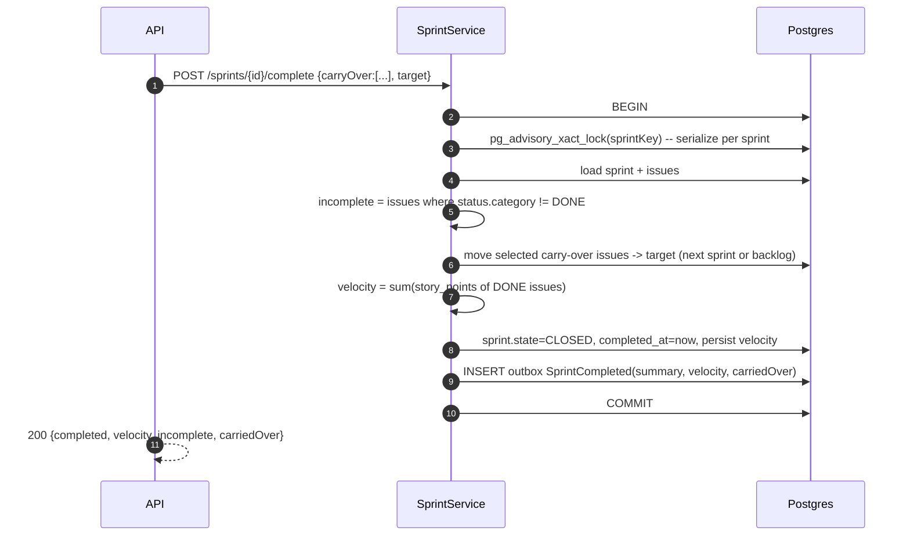

# LLD: Workflow Engine & Sprint Lifecycle

- **Related:** [data-model §4](../architecture/data-model.md), [concurrency LLD](concurrency.md), [ADR-0008 advisory locks](../adr/0008-advisory-locks-sprint-ops.md)

The workflow is **data, not code**: statuses and transitions are rows ([data-model §4](../architecture/data-model.md)),
so each project can have its own board columns and rules without code changes.

---

## 1. Domain model

```
Workflow ──< WorkflowStatus (name, category TODO|IN_PROGRESS|DONE, position, wip_limit?)
         └─< WorkflowTransition (from_status?, to_status, guard JSONB, post_action JSONB)
Issue.status_id ─> WorkflowStatus
```

- A `null` `from_status` marks the **creation transition** (which status new issues enter).
- `category` gives the board its columns and defines "done" semantics (velocity, carry-over).
- `guard` / `post_action` are **declarative rule specs** the engine interprets (below).

---

## 2. Transition execution



**Algorithm:**
1. Load issue (with its `version`) and the project's workflow.
2. Resolve the `WorkflowTransition` from `current.status` → `target`. **None → `422`** with the list
   of allowed transitions from the current status.
3. Evaluate **guards** (all must pass; collect failures for a useful 422).
4. Apply the status change with `UPDATE ... WHERE id=? AND version=?` (optimistic lock; conflict → 409).
5. Run **post-actions**. Synchronous ones (assign reviewer) happen in-tx; side-effecting ones
   (notify) are driven by the emitted event.
6. Emit `StatusChanged`; the outbox propagates it ([ADR-0006](../adr/0006-domain-events-outbox.md)).

### Guard types (declarative)
| Guard spec | Meaning | Failure |
|------------|---------|---------|
| `{"requireAssignee": true}` | Issue must have an assignee | 422 "assignee required" |
| `{"requireFields": ["story_points"]}` | Named fields must be set | 422 lists missing fields |
| `{"blockIfChildrenOpen": true}` | Sub-tasks must be DONE first | 422 "N sub-tasks open" |
| `{"wipLimit": true}` | Target column WIP limit not exceeded | 422 (race-safe — see below) |

### Post-action types
| Action spec | Effect | Sync/async |
|-------------|--------|:----------:|
| `{"assignReviewer": "ROUND_ROBIN"}` | Set assignee from project members | sync |
| `{"clearAssignee": true}` | Unassign | sync |
| `{"notify": ["assignee","watchers"]}` | Notify on entry | async (event) |
| `{"setResolution": "DONE"}` | Stamp resolution on entering a DONE status | sync |

> **WIP limit is a concurrency problem, not just a guard.** Two simultaneous moves into a column at
> its limit can both pass a naive check. The race-safe enforcement (advisory lock keyed by
> `(project, status)`, re-check under lock) is specified in the [concurrency LLD](concurrency.md).

---

## 3. Sprint lifecycle

States: `FUTURE → ACTIVE → CLOSED`. One `ACTIVE` sprint per project (enforced).

| Operation | Rule |
|-----------|------|
| Create | New `FUTURE` sprint with optional dates/goal |
| Move issue backlog↔sprint | `issues.sprint_id = sprint \| null`; only `FUTURE`/`ACTIVE` targets |
| Start | Must be no other `ACTIVE` sprint; sets `ACTIVE` + `start_date` |
| Complete | Carry-over + velocity, sets `CLOSED` |

### Sprint completion



- The **advisory lock** ([ADR-0008](../adr/0008-advisory-locks-sprint-ops.md)) makes the whole
  multi-row operation atomic against a concurrent complete/start, so carry-over can't double-apply
  and velocity can't be corrupted.
- **Carry-over is selective**: the client passes which incomplete issues to move and the target
  (next sprint or backlog); the response surfaces what was incomplete and what was carried.
- **Velocity** = sum of `story_points` over issues whose status category is `DONE` at completion;
  stored on the sprint for historical reporting and exposed via the sprints API.

---

## 4. Configurability & integrity

- A **default workflow** (To Do → In Progress → In Review → Done, with sensible transitions) is
  seeded so a new project works out of the box.
- Admin/Lead endpoints let a project customize statuses/transitions. Validation: a transition must
  reference statuses of the same workflow; a status that issues currently occupy cannot be deleted;
  exactly one creation transition must exist.

---

## 5. Trade-offs

| Decision | Why | Alternative rejected |
|----------|-----|----------------------|
| Declarative JSON guards/actions | Configurable without code; easy to seed/test | Scripted/plugin rules — powerful but a security & complexity sink |
| Pragmatic rules engine | Covers the workflow rules cleanly | Full BPMN/state-machine engine — overkill |
| Engine enforces hierarchy/type rules in domain | Policy can change without migrations | Schema-enforced — rigid ([ADR-0013](../adr/0013-issue-type-modeling.md)) |

**Implemented & tested:** transition execution with guards; the full sprint lifecycle — start,
complete with selective carry-over + velocity, **list** (`GET /projects/{key}/sprints`), and
**move issue ↔ sprint/backlog** (`PUT /issues/{key}/sprint`).

**Designed, not yet built:** declarative post-actions (`assignReviewer`/`notify`) are modeled in the
schema (`post_action` column) but not yet executed; status/transition admin CRUD.